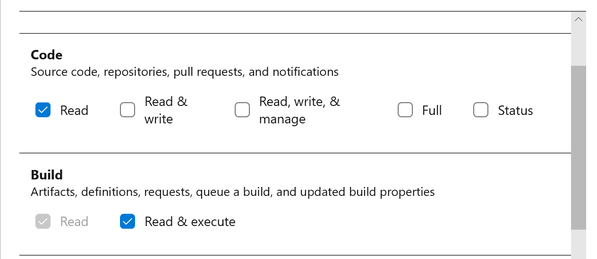
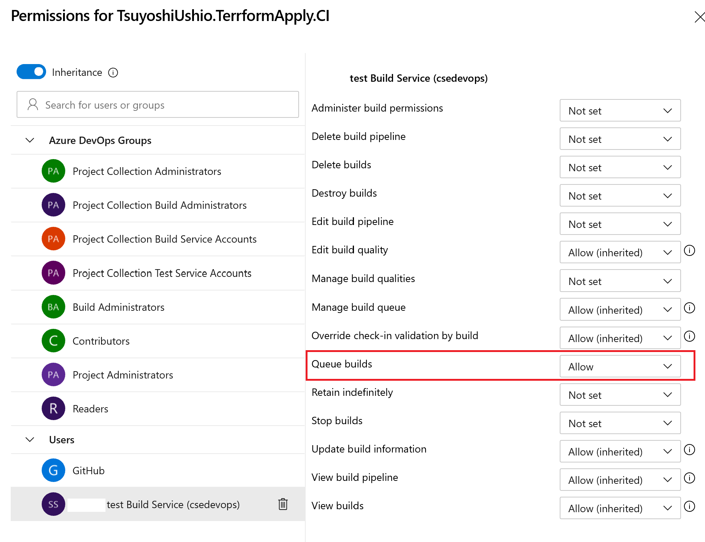
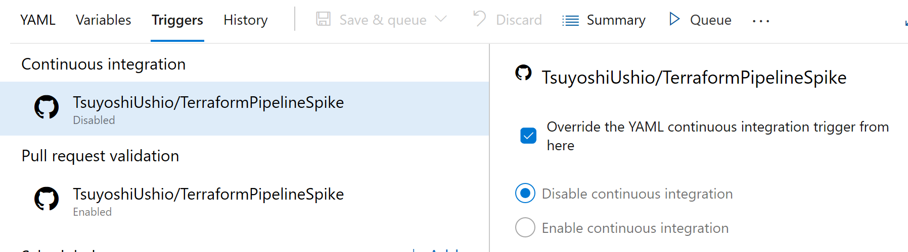
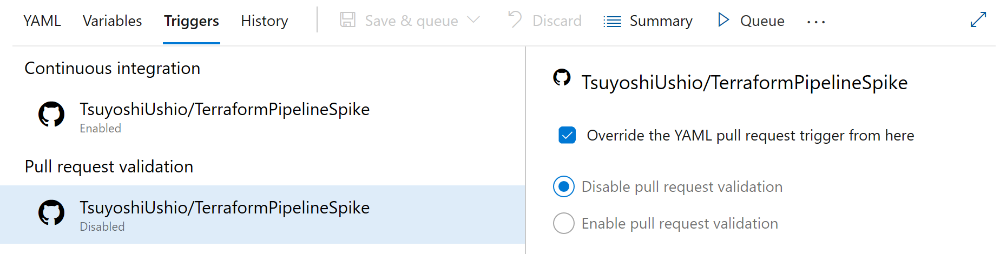

# Spike solution for terraform pipeline

This pipeline is a sample for PR flow of terraform.

1. Apply Terraform on Master Branch.
2. Apply Terraform on the Pull Request Branch.

To achieve this, I'm using Run Pipeline task that is developed by Brent. 

## Create a storage account for terraform state. 

## Configure Pipeline
There is some tips for configuring pipeline. 

### Tip1. Create Service Connection for Run Pipeline Task. 

The personal accesstoken requires, Read Code and Build Read & execute.



### Tip2. Give permision to a child pipeline

I assume two pipelines. One is [parent](azure-pipelines.yml), and the other is [child](child.yml) pipeline. Go to the Child Pipeline, Click `...` then `Manage Security`. You need to add `Queue Build` for the Buld Service user. 



If not, you will find this error. 

```
TF215106: Access denied. ABC test Build Service (csedevops) needs Queue builds permissions for build pipeline 292:TsuyoshiUshio.TerrformApply.CI in team project syncier test to perform the action. For more information, contact the Azure DevOps administrator.
```

### Tip3. Child pipeline YAML file should be reside in the Master pipeline.

If you run the child pipeline using Azure Run Pipeline Task, the child pipeline's YAML file should be in the target branch. 

If not, you will find this error. 

```
Could not queue the build because there were validation errors or warnings. 
```

##[error]Delegate pipeline run failed.

### Tip4. Disable Default Trigger

This is the trigger configuration. If you configure like this, then you push a PR. Then what happens is, child pipeline trigged at the same time as parent. It weird. The child should be run by the Parent. 

It looks AzureDevOps bug, however, you need to do two things. 

#### Disable the default trigger for Parent Pipeline

Edit the Parent Pipeline > `...` > Triggers > Disable Continuous Integration. 



#### Disable the default PR trigger for Child Pipeline

I can confgure `pr:none` one the child pipeline, however, it stop running on the Parent PR trigger. 

Edit the Parent Pipeline > `...` > Triggers > Disable PR Trigger.



_[Parent](azure-pipelines.yml)_

```yml
trigger:
- none
pr:
- master
```

_[Child](child.yml)_

```yml
trigger:
- none
```

### Tip 5. Avoid Lease Lock 
Terraform backend lock lease on the Azure Storage. You need to avoid run the pipeline at the same times. (For this reason, I had to Tip 4.)

## NOTE

This Pipeline assumes that there is no PR from Fork repo.

## Init terraofrm with subscription_id  for local execution

```bash
az login 
terraform init -backend-config=storage_account_name=<YOUR_STORAGE_ACCOUNT> -backend-config=container_name=tfstate -backend-config=resource_group_name=remove-spike-rg -backend-config=key=example.tfstate
```
