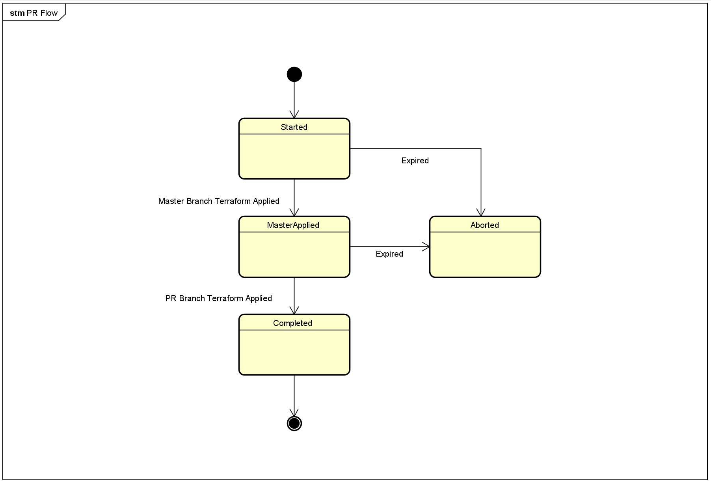

# PR Flow Scenario

This document explains the state diagram of the PR flow and pattern of the transitioning. 

# Scenario

You can setup the Variables Group 

| No. | Description | Current State (State, Expire, PullRequestNumber) | Expected Behavior |
| --- | ----------- | ------------- | ----------------- |
| 1 | The First PR (Completed with Expired)  | Completed, Expired, 0 | Success, State=Aborted, ExpiredDate is updated, Run All pipeline|
| 2 | Start from New | Aborted, ExpiredDate is updated, 0 | Success, State=Completed, Run All Pipeline |
| 3 | Completed PR with Other PRNumber | Completed, NotExpired, 0 | Success, State=Completed, ExpiredDate is updated, Run App Pipeline |
| 4 | Active PR with Other PRNumber | MasterApplied, NotExpired, 0 | Fail, State is not changed, Not Run pipeline |
| 5 | Active PR with current PRNumber | Started, NotExpired, (current PR number) | Success, ExpiredDate is updated, Completed, Run All Pipeline |
| 6 | Active PR with current PR Number | MasterApplied, NotExpired, (current PR number) | Success, Completed, ExpiredDate is updated, Skip Master Branch, Apply Current Branch only |
| 7 | Error on Master Apply | Completed, NotExpired, (any PR number) | Fail, Status=Started, ExpiredDate is updated, Execute Master Apply and fail |
| 8 | Error on Branch Apply | Completed, NotExpired, (any PR number) | Fail, Status=MasterApplied, ExpiredDate is updated, Success Master Apply and fail on Branch Apply |
| 9 | Error on Branch Apply | MasterApplied, NotExpired, (current PR number) | Fail, Status=MasterApply, ExpiredDate is updated, Only run Branch Apply and fail |
| 10 | Active PR with Expired | MasterApplied, Expired, (any PR number) | Fail, Status=Aborted, ExpiredDate is updated to new ExpiredDate |
| 11 | Aborted PR with Expired | Aborted, Expired, (any PR number) | Success, Status=Completed, ExpiredDate is updated to new ExpiredDate, Run All pipeline |

